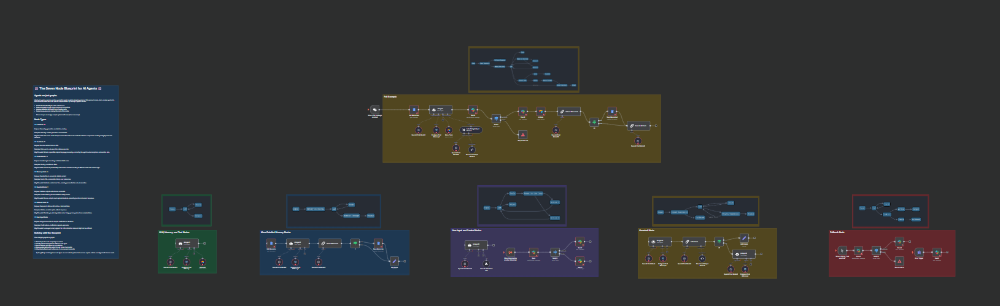
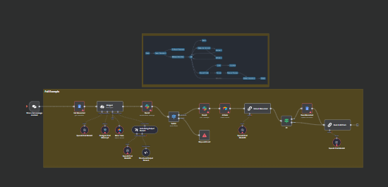

# 7 Node Blueprint for AI Agents



A visual framework for designing AI agents as interconnected graphs using n8n workflow automation.

## Overview

The 7 Node Blueprint provides a powerful mental model for designing AI agents as interconnected graphs. By breaking down your agent into seven essential node types, you create systems that are more capable, maintainable, transparent, and resilient.

This repository contains:
1. A detailed explanation of the 7 Node Blueprint
2. An n8n workflow JSON file implementing the blueprint
3. Setup instructions for running the example workflow

## The 7 Node Blueprint

### 1. 🧠 LLM Nodes: The Intelligence Layer

**Purpose**: Reasoning, generation, and decision-making

**Examples in n8n**: OpenAI Chat Model, LLM Chain, Agent

LLM nodes are the "brains" of your AI agent. They process information, generate content, and make decisions based on context.

```
Key applications:
- Complex reasoning tasks
- Content generation
- Decision making
- Planning multi-step actions
- Understanding natural language
```

### 2. 🛠️ Tool Nodes: Extending Capabilities

**Purpose**: Execute external actions and access data

**Examples in n8n**: Database queries, HTTP requests, API calls, file operations

Tool nodes allow your AI agent to interact with the external world, greatly expanding its capabilities beyond just language processing.

```
Key applications:
- Retrieving data from external sources
- Manipulating files and databases
- Calling specialized APIs
- Performing web searches
- Executing custom code
```

### 3. ⚙️ Control Nodes: Orchestrating Logic Flows

**Purpose**: Handle logic, branching, and deterministic rules

**Examples in n8n**: Switch, If, Merge, Split, Queue

Control nodes manage how information flows through your agent, implementing business logic and making deterministic decisions.

```
Key applications:
- Conditional routing
- Business rule implementation
- Workflow orchestration
- Error classification
- State management
```

### 4. 📚 Memory Nodes: Maintaining Context

**Purpose**: Store and retrieve information across interactions

**Examples in n8n**: Database storage, vector stores, conversation history

Memory nodes give your agent the ability to remember past interactions and learn from them over time.

```
Key applications:
- Conversation history tracking
- Knowledge base management
- User preference storage
- Vector embeddings for semantic search
- Learning from past interactions
```

### 5. 🚧 Guardrail Nodes: Ensuring Quality and Safety

**Purpose**: Validate outputs and enforce constraints

**Examples in n8n**: Content filters, output validators, fact-checkers

Guardrail nodes ensure that your agent behaves appropriately and produces reliable, safe outputs.

```
Key applications:
- Content safety filtering
- Output format validation
- Factual accuracy checking
- Brand voice enforcement
- Compliance monitoring
```

### 6. 🔄 Fallback Nodes: Graceful Error Handling

**Purpose**: Manage failures and provide alternatives

**Examples in n8n**: Error handlers, retry mechanisms, default responses

Fallback nodes ensure your agent degrades gracefully when things go wrong instead of failing completely.

```
Key applications:
- Error detection and handling
- Retry mechanisms with backoff
- Default responses when primary paths fail
- Escalation procedures
- Recovery strategies
```

### 7. 👥 User Input Nodes: Human-in-the-Loop

**Purpose**: Involve humans for judgment or decisions

**Examples in n8n**: Approval workflows, clarification requests, expert review

User input nodes strategically bring humans into the loop when their judgment or expertise is needed.

```
Key applications:
- Content approval workflows
- Ambiguity resolution
- Complex decision validation
- Expert input for specialized domains
- Training and feedback collection
```

## Node Identification in the Example Workflow

Our example workflow demonstrates all seven node types working together:



### LLM Nodes:
- OpenAI Chat Model
- AI Agent nodes
- LLM Chain nodes

### Tool Nodes:
- Menu Table (Airtable integration)
- Google Docs nodes
- HTTP Request nodes (for API calls)

### Control Nodes:
- Switch nodes
- If conditionals
- Edit Fields for data transformation

### Memory Nodes:
- Postgres Chat Memory
- Get/Save Memories via Google Docs

### Guardrail Nodes:
- Critic Node (checks dish descriptions)
- Structured Output Parser (enforces output format)

### Fallback Nodes:
- Stop and Error nodes
- Error handlers
- Default responses

### User Input Nodes:
- Slack approval workflows
- Approval request nodes

## Setup Instructions

### Prerequisites

1. [n8n](https://n8n.io/) installed (version 1.0.0 or later)
2. OpenAI API key
3. Optional: Supabase account for PostgreSQL memory storage
4. Optional: Google account for document storage
5. Optional: Slack account for notifications and approvals

### Installation

1. Clone this repository:
   ```
   git clone https://github.com/MuLIAICHI/7-node-blueprint
   cd 7-node-blueprint
   ```

2. Import the workflow into n8n:
   - Open your n8n instance
   - Go to Workflows > Import From File
   - Select the `7-node-blueprint-workflow.json` file from this repository

3. Configure credentials:
   - Set up OpenAI API credentials in n8n
   - Configure Supabase credentials if using PostgreSQL memory
   - Set up Google Drive credentials if using document storage
   - Configure Slack credentials if using for approvals

4. Activate the workflow and test with the built-in chat interface

## Customization

The workflow is designed to be modular and adaptable. Here are some ways to customize it:

1. **Change the LLM**: Swap OpenAI for other models like Anthropic's Claude or Google's Gemini
2. **Add Tools**: Connect additional tools like web search, database access, or custom APIs
3. **Modify Memory**: Change the memory implementation to use different storage options
4. **Adjust Guardrails**: Customize the critic agent to reflect your specific content guidelines
5. **Change Approval Flow**: Modify the human approval process to fit your team's workflow

## Additional Resources

- [Full blog post on the 7 Node Blueprint](https://medium.com/@mustaphalia/the-7-node-blueprint-a-visual-framework-for-designing-powerful-ai-agents-c782f5b2a46e)
- [n8n Documentation](https://docs.n8n.io/)
- [OpenAI Documentation](https://platform.openai.com/docs)
- [AI Agentic Workflows Guide](https://blog.n8n.io/ai-agentic-workflows/)

## Contributing

Contributions are welcome! Please feel free to submit a Pull Request.

## License

This project is licensed under the MIT License - see the LICENSE file for details.

## Contact

- GitHub: [MuLIAICHI](https://github.com/MuLIAICHI)
- Hire me: [PeoplePerHour](https://www.peopleperhour.com/freelancer/technology-programming/mustapha-liaichi-web-scraping-rag-ai-data-science-nnjjxyv)
